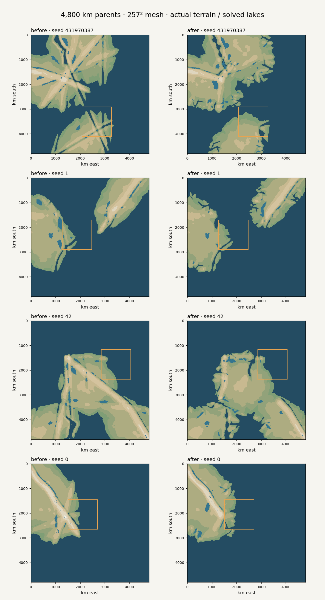
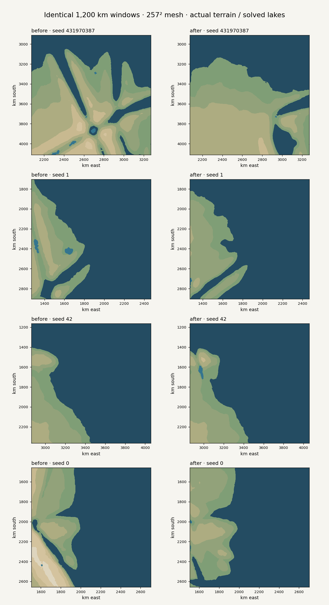

# Regional landform comparison

Baseline: `1dc4b26b79e3eaf38d81d0fa850d397721a8036a` on PR #29. Updated: the regional landform changes committed with this evidence.

Both columns use a 4,800 km parent, 257² irregular mesh (18.75 km nominal spacing), three continent blocks, crust scale 1.15, relief 1, rain 1, west wind, and seeds **431970387, 1, 42, 0** in that order. Window coordinates come from the baseline's `chooseWindow(world, 0)` and are held fixed in both columns. The orange parent-map boxes show those same 1,200 km windows.

The figures use actual `generateParentTerrain()` elevation and `predictFromTerrain()` solved lakes. Matplotlib contours interpolate the real mesh triangles; dark blue is terrain below sea level and lighter blue is the solved lake mask. This is a geometry diagnostic, not a screenshot of the app's shaded biome renderer. No settlement placement or shoreline was hand-painted.

## Findings

- Default seed: the false radial mountain/trough streaks disappear. Several substantial land bodies separate from the northern landmass; the eastern and southern coasts gain branches. The default southern window becomes quieter after its false faults are removed.
- Seed 1: the two main landmasses remain distinct. Some shores gain branching inlets and offshore bedrock while the selected eastern coast keeps a long margin and relatively simple bay.
- Seed 42: the diagonal interior streak ends at the real fault. Its northeast coast gains an embayment with uneven headlands; smoother coastline remains elsewhere.
- Seed 0: the radial artifacts and repeated carving of the same rift disappear. A detached land body forms near the western shore and the eastern bays retain a gentler character.

The new structure is in physical elevation before final water classification and human history. It is deliberately not uniformly jagged. This prototype does not resolve small skerries, local beaches, or channels narrower than a few regional samples. It also does not model full glaciation, changing sea levels, or detailed coastal sediment transport.

## Verification

- `node --test`: **159 passed**.
- `node scripts/build-watershed.mjs`: **passed**, including app/worker module linking and all four frozen benchmark checks, without source-service downloads.
- `git diff --check`: passed.
- Focused regressions were observed failing before their fixes: finite fault endpoints, bent-margin distance, emerged/drowned shelf relief, parent-stage integration, curved segmented rifts, repeated source-rift carving, and continuity across rift/subduction endpoint tangents. The last case was identified by independent code review and corrected before publication.
- Full-size geography and history smoke checks covered the four seeds and both dry/high-relief and wet/low-relief settings. Flow is acyclic, upstream land area balances at sinks, and settlements/routes occupy dry nodes. History leaves terrain unchanged.

Existing seeds intentionally describe different terrain in this model revision. The selected window does not affect the generated parent. Preview/device verification is recorded in the PR.
